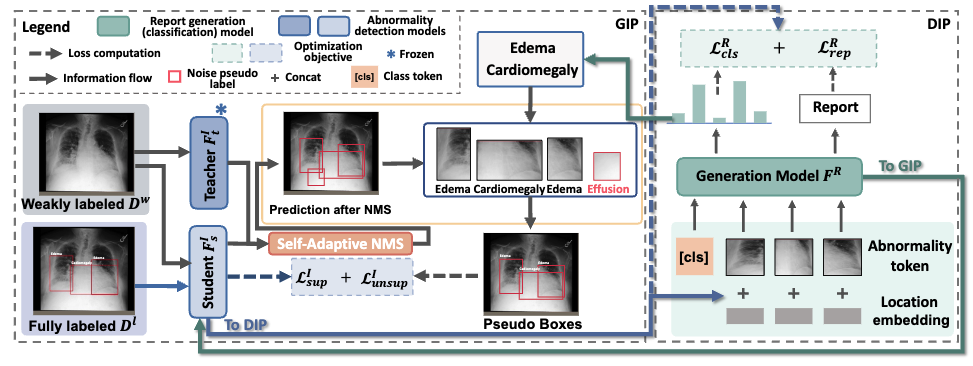

# Unlocking the Potential of Weakly Labeled Data: A Co-Evolutionary Learning Framework for Abnormality Detection and Report Generation
This repo contains the reference source code for the paper [**Unlocking the Potential of Weakly Labeled Data: A Co-Evolutionary Learning Framework for Abnormality Detection and Report Generation**]. In this project, we proposes a co-evolutionary abnormality detection and report generation (CoE-DG) framework that utilizes both fully labeled (with bounding box annotations and clinical reports) and weakly labeled (with reports only) data to achieve mutual promotion between the abnormality detection and report generation tasks. Our implementation is based on [Pytorch](https://pytorch.org/).
<div align="center">
	
</div>

This repository was built from [R2Gen](https://github.com/cuhksz-nlp/R2Gen) and [RetinaNet](https://github.com/yhenon/pytorch-retinanet).

### Data preparation
1. [MIMIC-CXR dataset](https://www.physionet.org/content/mimic-cxr-jpg/2.0.0/#files-panel)
2. [MS-CXR dataset](https://physionet.org/content/ms-cxr/0.1/)

### Run the code
**(a) Generator-guided Information Propagation (GIP)**

Pretrain Detection Model:
```
python3 detection/train_mimic.py --dataset mimic --depth 101 --save_folder [save_folder] 
```
flags:
- `save_folder`: specify the checkpoints save folder.
- `depth`: specify the depth of ResNet.

```
python3 -u detection/train_detection_coe.py --dataset mimic  --depth 101 --save_folder [save_folder] --report_ann_path [report_ann_path] --batch_size [batch_size] --labeled_bs [label_bs] --load_model [pretrained_detection_path] --thresh_score 0.9 --epochs [epochs]
```

flags:
- `save_folder`: specify the checkpoints save folder.
- `report_ann_path`: specify the file path containing the information from generation model.
- `label_bs`: specify the batch of labeled data in a batch.
- `pretrained_detection_path`: specify the path of pretrained detection model.


**(b) DIP: Detector-guided Information Propagation (DIP)**

```
python3.7 generation/main_train_generation_coe.py --dataset_name mimic_detection_multi --max_seq_length 100 --threshold 10 --batch_size 16 --epochs [epochs] --save_dir [save_dir] --resume_detection [resume_detection] --step_size 1 --gamma 0.8 --seed [seed] --loc_mode convert 
```

flags:
- `save_dir`: specify the checkpoints save folder.
- `resume_detection`: specify the path of pretrained detection model
- `loc_mode`: specify the location embedding mode.

## Citation
Please cite our paper if the code is helpful to your research.
```
```

## Concact
If you have any question, please feel free to concat Jinghan Sun (Email: jhsun@stu.xmu.edu.cn)